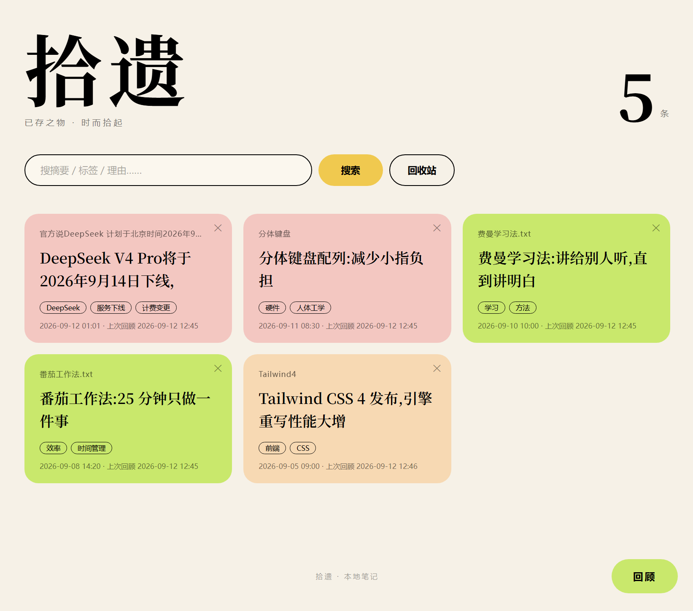
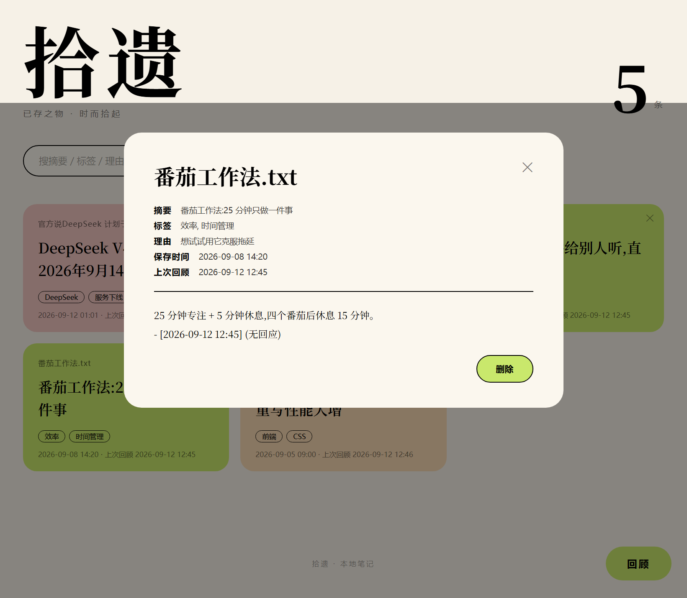
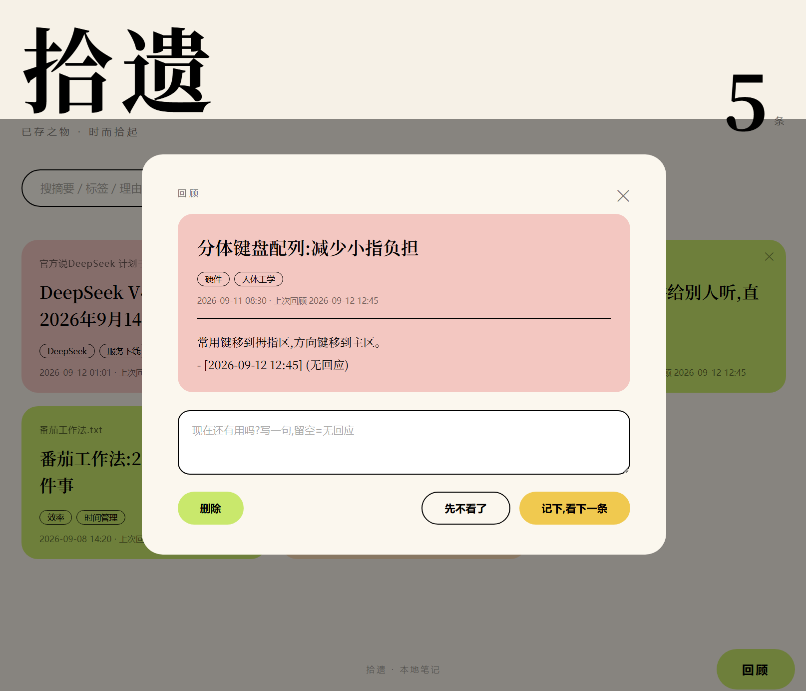
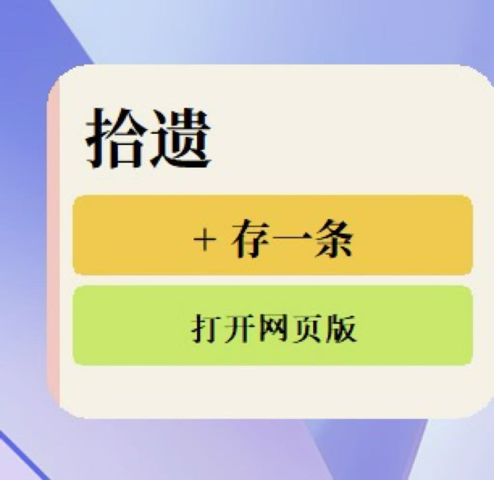
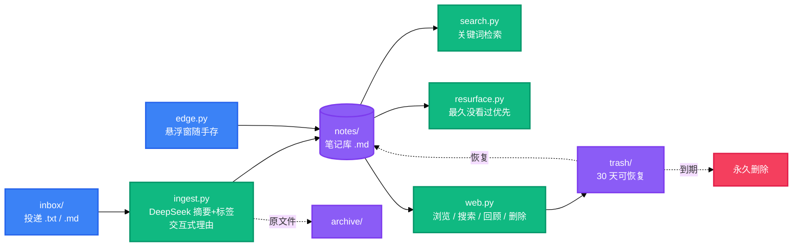
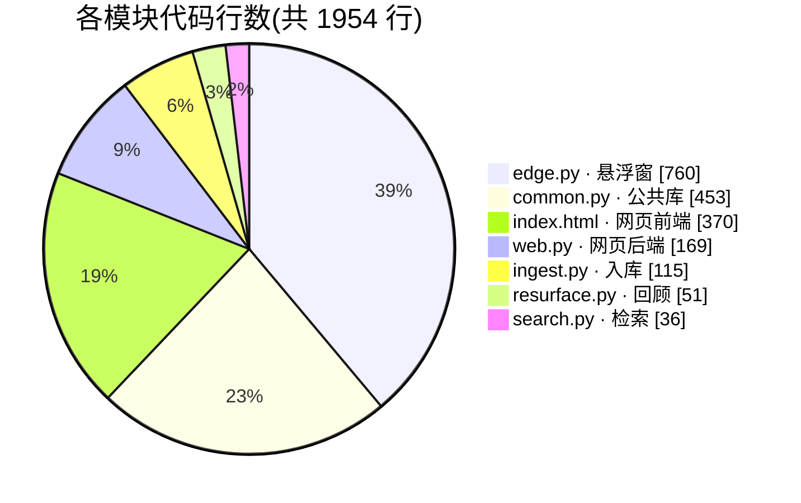

<h1 align="center">拾遗 · save_anything</h1>

<p align="center">
  <strong>把随手存下来的东西,变成以后找得回来、记得起为什么的笔记。</strong>
  <br />
  <em>DeepSeek 摘要与标签 · 全文检索 · 定期回顾 · 杂志风网页 · 回收站 · 零第三方依赖</em>
</p>

<p align="center">
  <a href="#快速开始"></a>
  <a href="LICENSE"></a>
</p>

<p align="center">
  
  
  
  
</p>

<p align="center">
  
</p>

<!-- BEAUTIFIED -->

一个个人向的 AI 知识收件箱:把想存的内容丢进 `inbox/`,DeepSeek 帮你提炼「是什么」(≤30 字摘要 + 2-4 个标签),你亲手写下「为什么存它」;想找的时候一句关键词搜回来;定期回顾,系统把最久没看过的笔记递到你面前,问一句「现在还有用吗?」,回答记回笔记。

<p align="center"><em>网页版界面</em></p>

<table>
  <tr>
    <td></td>
    <td></td>
    <td></td>
  </tr>
</table>



## 特性

- **零第三方依赖** — Python 3.9+ 纯标准库直调 DeepSeek API,无需安装任何包
- **AI 摘要与标签** — ≤30 字摘要 + 2-4 个标签,输出三级兜底、重试细分
- **理由即记忆** — 每条笔记记录「为什么存它」,检索可命中理由
- **杂志风网页与回收站** — 浏览 / 搜索 / 回顾一站式,删除进回收站保留 30 天可恢复,原生 HTML/CSS/JS 无构建
- **桌面悬浮窗** — 贴屏幕右缘的粉色细条,悬停展开,随手存、一键拉起网页版(Windows)
- **定期回顾** — 合并排序推出最久没看过的笔记,回答追加回笔记正文

## 快速开始

### 1. 配置 DeepSeek API Key(二选一)

```bash
# 方式一:环境变量
set DEEPSEEK_API_KEY=sk-...

# 方式二:项目根目录建 config.env(已被 gitignore,不会进仓库)
echo DEEPSEEK_API_KEY=sk-... > config.env
```

### 2. 存一条

```bash
# 把想存的 .txt / .md 丢进 inbox/,然后:
python ingest.py
#   逐条打印 AI 摘要与标签 → 让你写一句理由(回车跳过,标「(待补)」)
#   写入 notes/,原文件移入 archive/
```

### 3. 找回来

```bash
python search.py 关键词 [关键词...]
#   搜 摘要 / 标签 / 理由,大小写不敏感,多词 AND,按保存时间倒序
```

### 4. 回顾与网页版

```bash
python resurface.py            # 推出最久没看过的笔记,问「现在还有用吗?」
python web.py                  # 浏览器打开 http://127.0.0.1:8000(浏览/搜索/回顾/回收站)
python edge.py [--edge left]   # 贴屏幕右缘的粉色细条(仅 Windows)
```

## 配置

| 配置项 | 说明 | 默认 |
| --- | --- | --- |
| 环境变量 `DEEPSEEK_API_KEY` | API Key,优先读取 | — |
| `config.env` | 环境变量缺失时读取,项目根目录(已 gitignore) | — |
| `--port` | web.py 监听端口 | `8000` |
| `--edge` | edge.py 贴边方向(`left` / `right`) | `right` |

## 数据流



## 模块与代码量

| 入口 | 职责 | 行数 |
| --- | --- | --- |
| [ingest.py](ingest.py) | 入库:DeepSeek 摘要+标签 → 交互式理由 → 写 notes/ → 原文件移 archive/ | 115 |
| [search.py](search.py) | 检索:关键词 AND、大小写不敏感、保存时间倒序 | 36 |
| [resurface.py](resurface.py) | 回顾:推出最久没看过的笔记,回答记回正文 | 51 |
| [web.py](web.py) | 网页版后端:浏览 / 搜索 / 回顾 / 回收站 API,只监听 127.0.0.1 | 169 |
| [web/index.html](web/index.html) | 网页版前端:杂志风单页,原生 HTML/CSS/JS | 370 |
| [edge.py](edge.py) | 桌面悬浮窗:悬停展开、随手存、一键拉起网页版(Windows/tkinter) | 760 |
| [common.py](common.py) | 公共库:API 调用与重试、笔记读写、检索与回顾规则 | 453 |
| 合计 | 6 个 Python 模块 + 1 个页面 | 1954 |



## API

全部 JSON、charset=utf-8,只监听 127.0.0.1,共 9 个端点:

| 方法 | 路径 | 说明 |
| --- | --- | --- |
| GET | `/` | 网页版页面(启动时读入内存) |
| GET | `/api/notes?q=关键词` | 笔记列表,多词 AND、大小写不敏感 |
| GET | `/api/note?path=…` | 单条全文,路径必须落在 notes/ 内(防目录穿越) |
| GET | `/api/review` | 下一条待回顾笔记(规则同 resurface.py) |
| POST | `/api/review` | `{"path", "answer"}` 回顾回答记回笔记 |
| GET | `/api/trash` | 回收站列表(先清理过期条目) |
| POST | `/api/delete` | `{"path"}` 笔记移入回收站 |
| POST | `/api/restore` | `{"name"}` 从回收站恢复 |
| POST | `/api/purge` | `{"name"}` 彻底删除回收站条目 |

## 成本测算

按 DeepSeek 官方定价(2026-09:输入 ¥1 / 百万 tokens 未命中缓存,输出 ¥2 / 百万 tokens),单条笔记按最坏情况估算:

| 指标 | 数值 |
| --- | --- |
| 输入上限 | 6000 字 ≈ 6000 tokens(笔记正文存全文,不截断) |
| 输出上限 | `max_tokens = 300` |
| 单条成本 | (6000×1 + 300×2) ÷ 10⁶ ≈ **¥0.007 ≈ 0.7 分钱** |
| 存 100 条 | ≈ ¥0.7 |
| 存 1000 条 | ≈ ¥7 |

价格以 [DeepSeek 官方定价页](https://api-docs.deepseek.com/zh-cn/quick_start/pricing/) 为准。

## 笔记格式

每条笔记一个 `.md`,头部为纯文本元数据,正文为原文全文:

```
---
标题: 原文件名
摘要: ≤30 字
标签: a, b, c
理由: 为什么存它(留空则「(待补)」)
保存时间: 2026-09-12 14:30
上次回顾: 最近一次被 resurface 展示的时间(缺失=从未)
---

<原文全文>
- [2026-09-12 14:31] 每次回顾追加一行:时间 + 回答
```

正文可以随手修改;头部改坏也不崩(按缺省元数据处理,下次回顾自动重建)。

## 目录结构

```
save_anything/
├── inbox/         # 投递目录:丢 .txt / .md 进来(gitignore 排除)
├── notes/         # 笔记产物:每条一个 .md
├── archive/       # 已处理的原文件
├── trash/         # 回收站:删除的笔记保留 30 天,到期自动永久清理
├── web/           # 网页版前端 index.html
├── docs/img/      # README 截图
├── ingest.py      # 入库
├── search.py      # 检索
├── resurface.py   # 回顾
├── web.py         # 网页版后端
├── edge.py        # 桌面悬浮窗
├── common.py      # 公共库
└── decisions.md   # 产品与技术决策记录
```

## 设计决策

每个产品判断与技术选型的背景、选项和理由,都记录在 [decisions.md](decisions.md),例如:

- 理由允许留空,标「(待补)」——降低记录成本,先收进来再说
- 「看过」= resurface 展示过,不依赖不可靠的文件访问时间
- 零第三方依赖:纯标准库直调 DeepSeek;笔记头部用纯文本格式,不引 YAML
- DeepSeek 输出三级兜底 + 重试细分:瞬时错误重试,确定性错误不重试
- 编码策略:utf-8-sig → gb18030 兜底,控制台三流统一 UTF-8

## 已知限制

- 手动触发:无文件监听、无定时任务
- 无数据库:笔记就是 `.md` 文件本身,检索在内存线性扫(个人量级足够)
- 只处理 inbox 里的 `.txt` / `.md`
- 发给 API 只取前 6000 字(笔记正文仍存全文),摘要质量取决于模型
- 悬浮窗仅支持 Windows 主屏
- 回收站清理在 web 启动或打开回收站时触发,无后台定时任务

## 编码注意事项(Windows)

- 以 Git Bash / Windows Terminal 为准;cmd + chcp 936 下提示文字可能乱码
- 输入文件自动识别 UTF-8(含 BOM)与 GBK
- 不要用管道把 GBK 编码的文本喂给脚本;交互输入中文请直接在终端打字

## License

[MIT](LICENSE)
