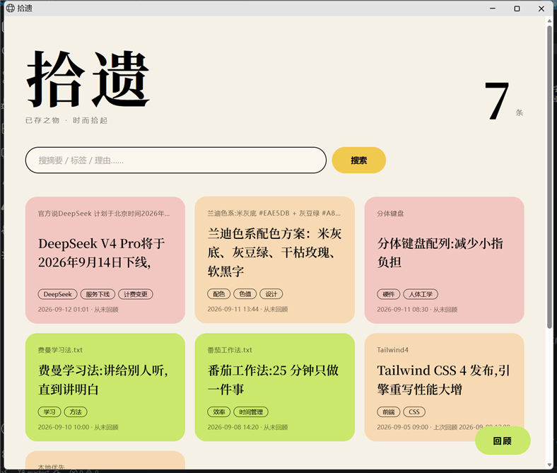

# 拾遗 · save_anything

> 把随手存下来的东西,变成以后找得回来、记得起为什么的笔记。

一个个人向的 AI 知识收件箱:把想存的内容丢进 `inbox/`,DeepSeek 帮你提炼「是什么」(≤30 字摘要 + 2-4 个标签),你亲手写下「为什么存它」;想找的时候一句关键词搜回来;定期回顾,系统把最久没看过的笔记递到你面前,问一句「现在还有用吗?」,回答记回笔记。



## 特性

- **零第三方依赖** — Python 3.9+ 纯标准库直调 DeepSeek API,无需安装任何包
- **双通道收录** — CLI 批量入库,或桌面悬浮窗随手存
- **AI 摘要与标签** — ≤30 字摘要 + 2-4 个标签,输出三级兜底、重试细分
- **理由即记忆** — 每条笔记记录「为什么存它」,检索可命中理由
- **杂志风网页** — 浏览 / 搜索 / 回顾一站式页面,纯原生 HTML/CSS/JS,无构建
- **定期回顾** — 合并排序推出最久没看过的笔记,回答追加回笔记正文

## 快速开始

### 1. 配置 DeepSeek API Key(二选一)

```bash
# 方式一:环境变量
set DEEPSEEK_API_KEY=sk-...

# 方式二:项目根目录建 config.env(已被 gitignore,不会进仓库)
echo DEEPSEEK_API_KEY=sk-... > config.env
```

### 2. 存一条

```bash
# 把想存的 .txt / .md 丢进 inbox/,然后:
python ingest.py
#   逐条打印 AI 摘要与标签 → 让你写一句理由(回车跳过,标「(待补)」)
#   写入 notes/,原文件移入 archive/
```

### 3. 找回来

```bash
python search.py 关键词 [关键词...]
#   搜 摘要 / 标签 / 理由,大小写不敏感,多词 AND,按保存时间倒序
```

### 4. 定期回顾

```bash
python resurface.py
#   推出最久没看过的笔记,问「现在还有用吗?」
#   输入回答记回笔记;回车=跳过不记录(下次回顾还会遇到);Ctrl+C 随时退出
```

### 5. 网页版 / 桌面悬浮窗

```bash
python web.py                 # 浏览器打开 http://127.0.0.1:8000
python edge.py [--edge left]  # 贴屏幕右缘的粉色细条(仅 Windows)
```

## 模块

| 入口 | 职责 |
| --- | --- |
| [ingest.py](ingest.py) | 入库:DeepSeek 摘要+标签 → 交互式理由 → 写 notes/ → 原文件移 archive/ |
| [search.py](search.py) | 检索:关键词 AND、大小写不敏感、保存时间倒序 |
| [resurface.py](resurface.py) | 回顾:推出最久没看过的笔记,回答记回正文 |
| [web.py](web.py) | 网页版后端:浏览 / 搜索 / 回顾 API,只监听 127.0.0.1 |
| [edge.py](edge.py) | 桌面悬浮窗:悬停展开、随手存、一键拉起网页版(Windows/tkinter) |
| [common.py](common.py) | 公共库:API 调用与重试、笔记读写、检索与回顾规则 |

## 笔记格式

每条笔记一个 `.md`,头部为纯文本元数据,正文为原文全文:

```
---
标题: 原文件名
摘要: ≤30 字
标签: a, b, c
理由: 为什么存它(留空则「(待补)」)
保存时间: 2026-09-12 14:30
上次回顾: 最近一次被 resurface 展示的时间(缺失=从未)
---

<原文全文>
- [2026-09-12 14:31] 每次回顾追加一行:时间 + 回答
```

正文可以随手修改;头部改坏也不崩(按缺省元数据处理,下次回顾自动重建)。

## 目录结构

```
save_anything/
├── inbox/         # 投递目录:丢 .txt / .md 进来(gitignore 排除)
├── notes/         # 笔记产物:每条一个 .md
├── archive/       # 已处理的原文件
├── web/           # 网页版前端 index.html
├── docs/img/      # README 截图
├── ingest.py      # 入库
├── search.py      # 检索
├── resurface.py   # 回顾
├── web.py         # 网页版后端
├── edge.py        # 桌面悬浮窗
├── common.py      # 公共库
└── decisions.md   # 产品与技术决策记录
```

## 设计决策

每个产品判断与技术选型的背景、选项和理由,都记录在 [decisions.md](decisions.md),例如:

- 理由允许留空,标「(待补)」——降低记录成本,先收进来再说
- 「看过」= resurface 展示过,不依赖不可靠的文件访问时间
- 零第三方依赖:纯标准库直调 DeepSeek;笔记头部用纯文本格式,不引 YAML
- DeepSeek 输出三级兜底 + 重试细分:瞬时错误重试,确定性错误不重试
- 编码策略:utf-8-sig → gb18030 兜底,控制台三流统一 UTF-8

## 已知限制

- 手动触发:无文件监听、无定时任务
- 无数据库:笔记就是 `.md` 文件本身,检索在内存线性扫(个人量级足够)
- 只处理 inbox 里的 `.txt` / `.md`
- 发给 API 只取前 6000 字(笔记正文仍存全文),摘要质量取决于模型
- 悬浮窗仅支持 Windows 主屏

## 编码注意事项(Windows)

- 以 Git Bash / Windows Terminal 为准;cmd + chcp 936 下提示文字可能乱码
- 输入文件自动识别 UTF-8(含 BOM)与 GBK
- 不要用管道把 GBK 编码的文本喂给脚本;交互输入中文请直接在终端打字
